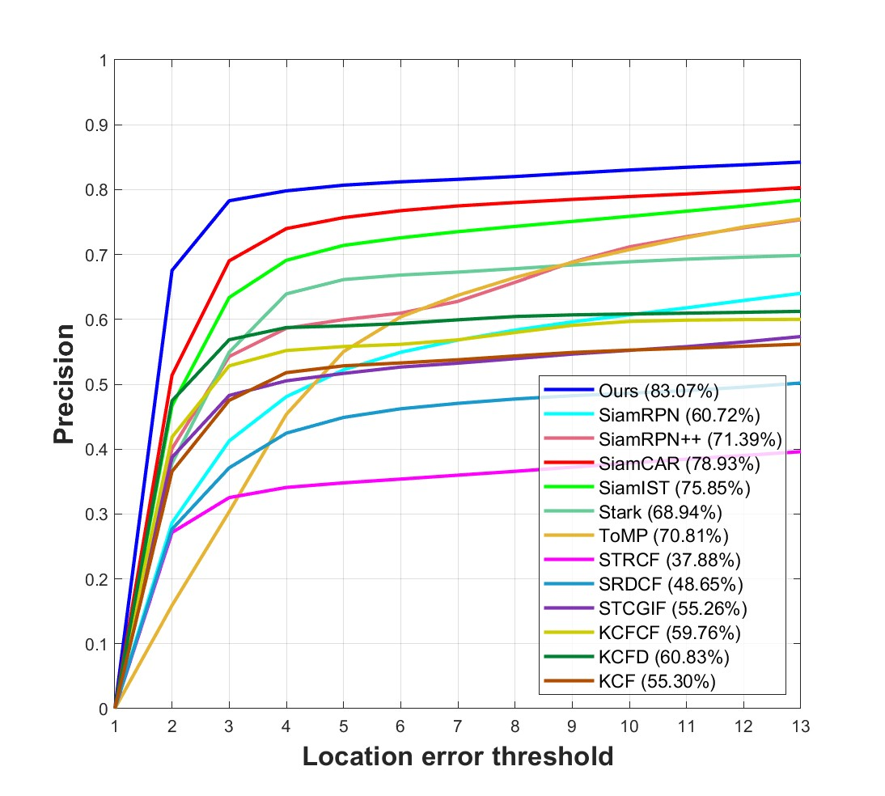
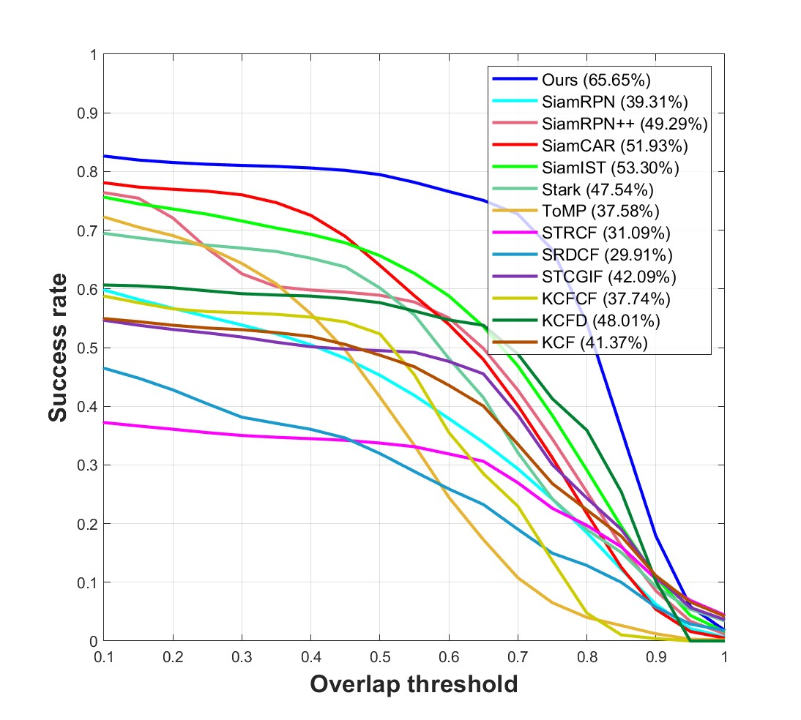

# SiamUF

The main contents of this project can be summarized as follows: 

1. A U-shaped deep feature extraction model is incorporated in a Siamese framework to capture robust features that refer to a small target. 
2. The side window filter suppresses the adverse effects of the edge in infrared images, which highlights the feature of small targets. 
3. The template update mechanism allows the tracking model to adapt to changes in the environment. 
4. The normalized Wasserstein distance is incorporated into the loss calculation as a new similarity metric to mitigate the issue of overly aggressive IoU loss changes for small objects.

## 1. Performance

The tracking evaluation based on the first 300 frames:

     

## 2. Environment

- python=3.8
- torch=1.13.1
- cuda=11.7
- torchvision=0.14.1

## 3. Datasets

Note: The test set we use consists of the last 18 weak and small single-target sequences from the 22 sequences, and the training set is also selected from these single-target video sequences.

- [train dataset](https://www.scidb.cn/en/detail?dataSetId=808025946870251520&version=V2)
- [test dataset](https://www.scidb.cn/en/detail?dataSetId=720626420933459968&version=V1)

## 4.Model

Download our pretrained model:  code: 

## 5.Results

We provide tracking results for comparison: In the code directory ......

## 6.Acknowledgement

The code is implemented based on[SiamCAR](https://github.com/ohhhyeahhh/SiamCAR). We would like to express our sincere thanks to the contributors.
